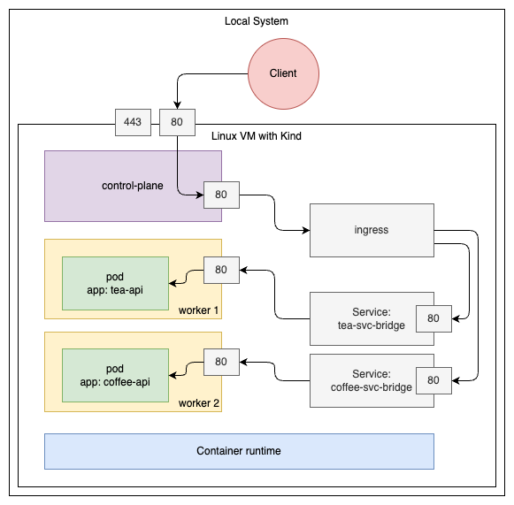

= Kubernetes - Cross namespace routing with ingress
:toc:

== Introduction

=== What's this?

This project provides a working demo, how to route traffic across namespaces in Kubernetes using `Ingress` and `externalName` services.

To be able to run the demo locally, the project comes with its own `Kind` cluster setup.

=== Architecture

=== Prerequisites

* Container runtime
* Kind
* Make
* Terminal

Please note, the demo has been developed on MacOS, using Podman Desktop (assumes running the container orchestrator inside a VM).

== Get started

* Clone this repository
* Create a new Kind cluster:
[source,bash]
----
make kind-cluster-create
----
* Make sure the Ingress controller is up and running:
[source,bash]
----
k get pods -n ingress-nginx
----
* Deploy the demo app:
[source,bash]
----
make app-deploy
----
* Query the two endpoints:
[source,bash]
----
curl localhost/tea
curl localhost/coffee
----
